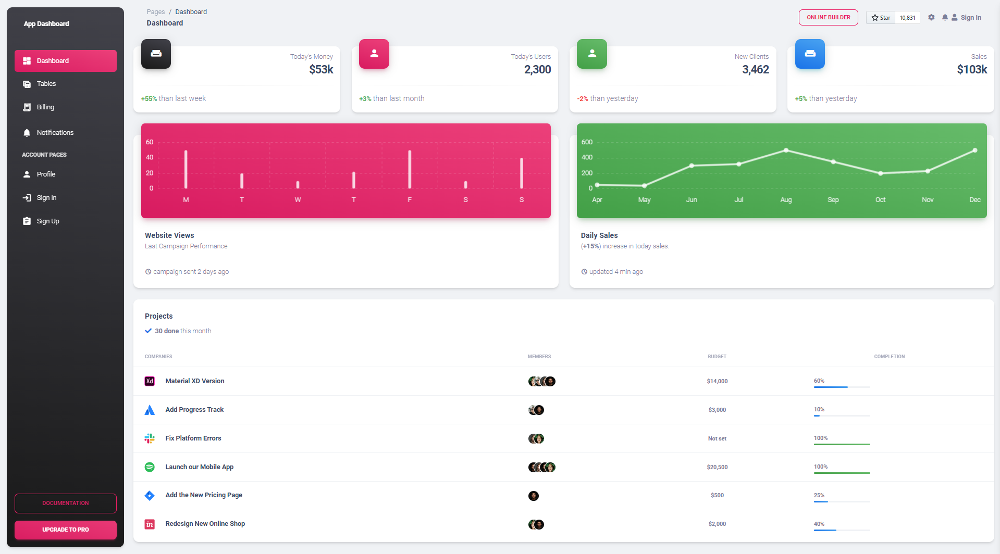
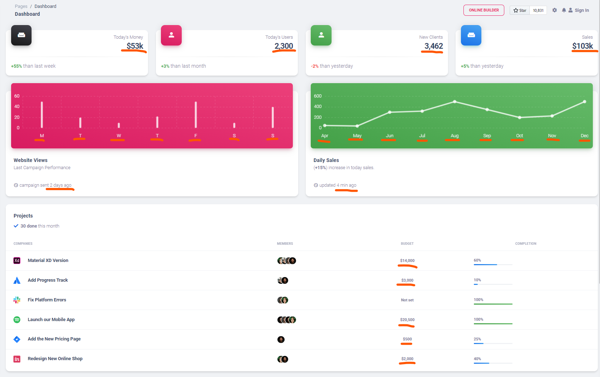
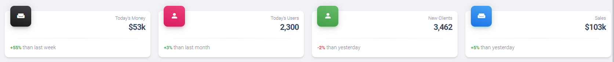
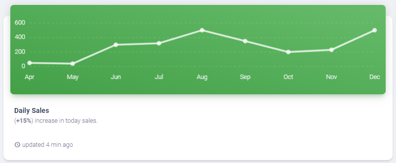
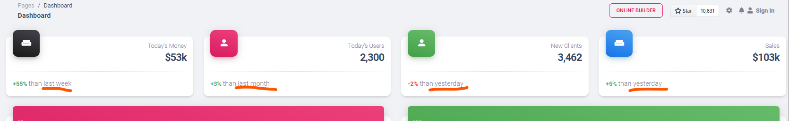

# FrontendExam

This project was generated with [Angular CLI](https://github.com/angular/angular-cli) version 16.2.1.

## Development server
Run `npm install` to install dependencies.

Run `ng serve` for a dev server. Navigate to `http://localhost:4200/main/dashboard`. The application will automatically reload if you change any of the source files.

## Build

Run `ng build` to build the project. The build artifacts will be stored in the `dist/` directory.

## Running unit tests

Run `ng test` to execute the unit tests via [Karma](https://karma-runner.github.io).

## Further help

To get more help on the Angular CLI use `ng help` or go check out the [Angular CLI Overview and Command Reference](https://angular.io/cli) page.

# Overview of Exam

A frontend practical exam is essential for applicants as it provides a tangible measure of their potential and skill in the position. Through practical tasks, candidates demonstrate their ability to translate limited design materials into functional user interfaces, problem-solving, and apply best practices in coding and design. It allows recruiters to assess candidates' proficiency in real-world scenarios within the company, ensuring they possess the practical skills required for the role.

Note: Please set up and run this Angular project accordingly, as we will be utilizing it in your examination.

The examination will center around the following areas:
  - Styling proficiently: `30 points`
  - Integrating Library Chart and Table: `30 points`
  - Creating Custom Pipes: `20 points`
  - Data Manipulation: `20 points`
  - Unit Testing: `20 bonus points`

# Styling proficiently: `30 points`

Below is the design we must integrate into our project. Kindly ensure that the font, color, spacing, dimensions, and other elements are replicated as closely as possible.

Design By: Creative Tim

**Note:**
  - You can add or alter HTML native elements but refrain from modifying Angular Material components (such as `mat-drawer`, `mat-list`, `mat-card`, and others).
  - You can utilize Angular Material theming, plain `CSS`, or `SCSS`; however, refrain from using other CSS libraries like `Bootstrap`, `Tailwind`, or other CSS frameworks.

# Integrating Library Chart and Table: `30 points`

Incorporate two charts and 1 table into the project, utilizing any open-source libraries that closely aligns with or fits our design.

Website Views Charts - You can place your chart in this component: `frontend-exam/src/app/modules/main/components/website-views-overview`, and utilize the `weeklyWebsiteViews` property within the `getWebsiteViewsOverview()` method in `frontend-exam/src/app/modules/main/services/reports.service.ts` to retrieve the data.

Daily Sales Charts - You can place your chart in this component: `frontend-exam/src/app/modules/main/components/daily-sales-overview`, and utilize the `monthlySales` property within the `getDailySalesOverview()` method in `frontend-exam/src/app/modules/main/services/reports.service.ts` to retrieve the data.

Projects Table - You can place your table in this component: `frontend-exam/src/app/modules/main/components/projects-overview`, and utilize the `getProjectsOverview()` method in `frontend-exam/src/app/modules/main/services/reports.service.ts` to retrieve the data.

**Columns: Properties**
- Companies: `title` and `companyIcon`
- Members: `members`
- Budget: `budget`
- Completion: `progressPercentage`

**Note:** The icons are located in this folder, `/home/kevin/loans/frontend-exam/src/assets/img`

# Creating Custom Pipes: `20 points`

We need to transform/format certain displays in the project, such as dates and numbers, using Angular Pipes. You may utilize the pre-created Pipe items located in `frontend-exam/src/app/shared/pipes`. The items highlighted in red are the ones we need to apply the transformation/formatting.

- `number.pipe`: Utilize the number.pipe to format numbers, incorporating a thousand comma and a shorthand 'K' for values exceeding 15 thousand.
  - Today's Money, Today's Users, New Clients and Sales value
  - Project Table: Budget column

- `date.pipe`: Utilize the number.pipe to format date, 
  - Website Views 
    - Chart x-axis labels: Convert the date format from '`2023-12-18` - `M`' to '`2023-12-24` - `S`'
    - Campaign sent: time elapsed conversion
  - Daily Sales 
    - Chart x-axis labels:  Convert the date format from '`2023-04-30` - `Apr`' to '`2023-12-31` - `Dec`'
    - Updated: time elapsed conversion

# Data Manipulation: `20 points`

Here, our focus lies in evaluating and managing the data based on the requirements, including sorting, filtering, and any other necessary actions

**Sorting**

Ensure that the order of Today's Money, Today's Users, New Clients, and Sales cards is correct.

**Filtering**
Ensure that when plotting the Daily Sales chart, only display the top 9 most recent data.

**Others**
Ensure that the `deltaPeriod` property is converted to be more readable for the user.

  - `monthly` to 'than last month' 
  - `weekly` to 'than last week'
  - `daily` to 'than yesterday'

# Unit Testing: `20 bonus points`

To ensure that our code functions as expected, we encourage creating unit tests for our work. Perform unit testing on each `component`, `service`, `pipe`, and other elements in the project.

-----------------------------------------------------

Thank you for participating in the Frontend exam. We hope you enjoy the challenge and achieve a high score. 

Wishing you the best of luck. 🙏🙂❤️

**Etrading Software** Development Team

